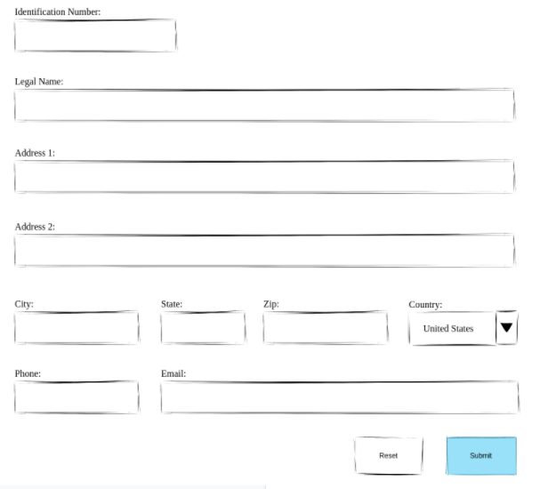
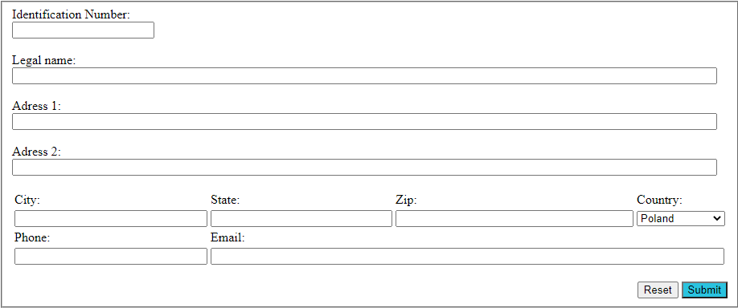
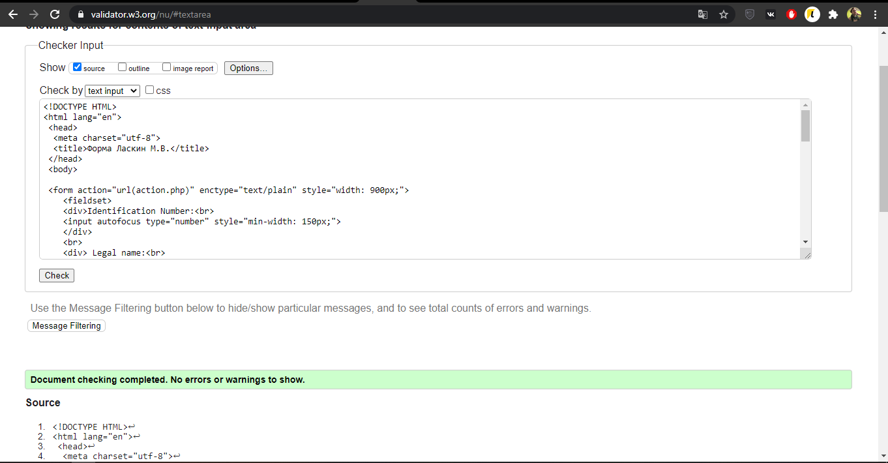
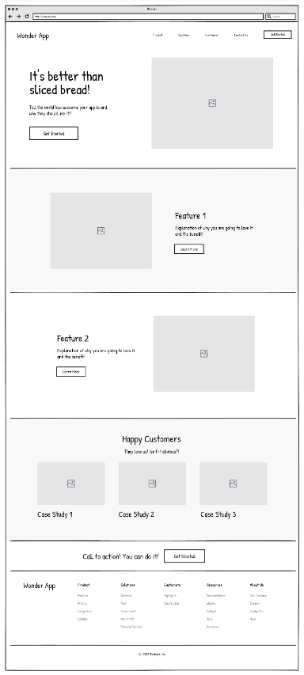
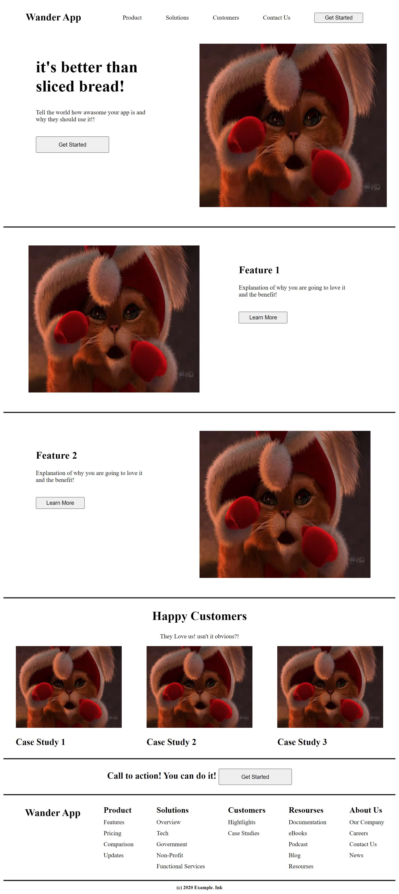
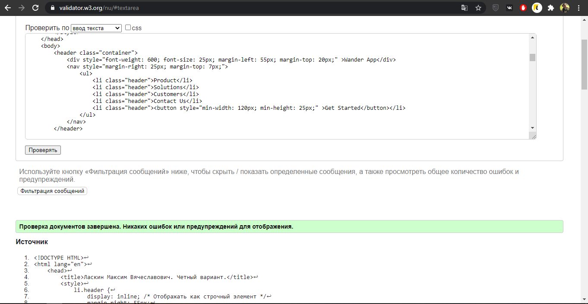

<p align ="center">МИНИСТЕРСТВО НАУКИ И ВЫСШЕГО ОБРАЗОВАНИЯ РОССИЙСКОЙ ФЕДЕРАЦИИ<br>
ФЕДЕРАЛЬНОЕ ГОСУДАРСТВЕННОЕ БЮДЖЕТНОЕ ОБРАЗОВАТЕЛЬНОЕ<br>
УЧРЕЖДЕНИЕ ВЫСШЕГО ОБРАЗОВАНИЯ<br>
«ВЯТСКИЙ ГОСУДАРСТВЕННЫЙ УНИВЕРСИТЕТ»<br>
Институт математики и информационных систем<br>
Факультет автоматики и вычислительной техники<br>
Кафедра систем автоматизации управления<br></p>
<br>
<br>
<br>
<br>
<br>
<br>
<br>
<p align= "center"><b>Изучение методов формирования html</b><br>
Отчет по лабораторной работе № 2<br>
по дисциплине<br>
Основы frontend-разработки и организации человеко-машинного интерфейса<br></p>
<br>
<br>
<br>
<br>
<br>
<br>
<p align="center">Выполнил студент гр. ИТб-1301-01-00 _________________ /Ласкин М.В./<br>
Руководитель ст. преподаватель _________________ /Земцов М.А./<br>
Работа защищена с оценкой			«___________» «___» __________ 2021 г.</p>
<br>
<br>
<br>
<br>
<br>
<br>

<p align="center">Киров 2021</p>
<br>
<hr>
<p>Цель работы: изучение блочных элементов и компонентов разметки форм в HTML5.<br>
<br>
Задачи работы:<br>
<ol><li>Организовать рабочее пространство и процессы разработки html5 документов.</li>
<li>Изучить типовые блочные элементы html5 документа.</li>
<li>Изучить типовые элементы построения форм html5 документа.</li>
<li>Выполнить самостоятельное задание.</li>
<li>Составить отчет по выполненным задачам.</li>
<li>Защитить лабораторную работу.</li></ol></p>

<h3>Ход работы</h3>
<br>
<h4>Задание №1</h4>

<p>прочитайте про теги формирования структуры документа.<br>
По результатам ответьте на следующие вопросы:
</p>
<ol>
<li>Для чего применяемый тег nav как его использовать?</li>
<li>Какие теги позволяют сделать боковую правую и левую панель?</li>
<li>Какой тег будет всегда вверху страницы?</li>
<li>Где может быть вставлен тег footer?</li>
<li>В чем разница между article и section?</li>
</ol>
<br>
<h4>Ответы на вопросы:</h4>
<ol>
<li>Тег nav применяется для выделения на странице основного блока с навигационными ссылками. Чаще всего используется для представления списка ссылок.</li>
<li>Тег aside.</li>
<li>Тег header.</li>
<li>В одном веб-документе может быть несколько элементов footer. Как каждая страница, так и каждая статья может иметь свой элемент footer. Также, footer можно поместить в элемент blockquote, чтобы указать источник цитирования.</li>
<li>Элемент article предназначен для обрамления статьи. Элемент section служит для группирования разделов по содержанию.</li>
</ol>
<br>
<h4>Задание №2</h4>

<p>Прочитайте про теги группировки контента..<br>
По результатам ответьте на следующие вопросы:
</p>
<ol>
<li>Для чего применяется тег dt как его использовать?</li>
<li>В чем различие тегов ol и ul?</li>
<li>Для чего применяется тег hr как его использовать?</li>
<li>Какие теги заменили тег div в сайтах на html4?</li>
<li>Для чего применяется тег address как его использовать?</li>
<li>В чем различие тегов figure и img?</li>
<li>Для чего применяется тег blockquote как его использовать?</li>
<li>В чем различие тегов main и section?</li>
<li>Какие из тегов невидимы для пользователя?</li>
</ol>
<br>
<h4>Ответы на вопросы:</h4>
<ol>
<li>Тег dt входит в тройку элементов dl, dt, dd, предназначенных для создания списка определений. Каждый такой список начинается с контейнера dl, куда входит тег dt создающий термин и тег dd задающий определение этого термина.</li>
<li>В теге ol изменение порядка элементов изменяет смысл документа. В теге ul порядок элементов не важен, то есть изменение порядка не приведет к существенному изменению смысла документа.</li>
<li>Тег hr применяется для разделение абзацев. Создает горизонтальную черту на странице.</li>
<li>header, main, footer, section, nav.</li>
<li>Тег address служит для представления контактной информации о человеке или организации.</li>
<li>Элемент figure представляет автономное содержимое, являющееся самостоятельным элементом основного потока.
С помощью тега figure можно добавлять краткие характеристики к иллюстрациям, фотографиям, диаграммам, фрагментам кода и т.д., а тег img представляет изображение.</li>
<li>Тег blockquote предназначен для выделения длинных цитат внутри документа.</li>
<li>В тег main должно входить основное содержимое элемента body, а тег section группирует тематическое содержимое.</li>
<li>ol, ul, dl.</li>
</ol>
<br>
<h4>Задание №3</h4>

<p>Прочитайте про теги формирования структуры документа.<br>
По результатам ответьте на следующие вопросы:
</p>
<ol>
<li>Какой атрибут формы служит для задания адреса отправки формы?</li>
<li>Каким образом можно задать поле для ввода многострочного текста?</li>
<li>Каким образом можно сгруппировать элементы формы?</li>
<li>Какие элементы пользовательского ввода нельзя реализовать через тег input?</li>
<li>Как сделать поле для ввода с выбором вариантов?</li>
<li>Для чего служит тег button и какие правила его использования?</li>
</ol>
<br>
<h4>Ответы на вопросы:</h4>
<ol>
<li>Атрибут action.</li>
<li>С помощью элемента textarea.</li>
<li>С помощью тега fieldset.</li>
<li>Нельзя реализовать голосовой ввод, элемент ввода путем рисования мышкой в поле.</li>
<li>С помощью тега select с атрибутом multiple</li>
<li>Тег button создает кликабельную кнопку, которая может быть представлена изображением или полем с текстом. Позволяет передавать данные в форму, очищать содержимое формы или предпринимать какие-либо другие действия. Для корректного отображения элемента button разными браузерами требуется указывать атрибут type, который может принимать значения: button, reset и submit.</li>
</ol>
<br>

<h4>Задание №4</h4>

<p>Разработайте макет формы регистрации пользователя, представленный ниже на рисунке 1. Сохраните макет в файл lab2_form.html. Стилизация макета не требуется. Код должен быть валидирован под HTML5.</p>
<br>
<p> Макет представлен на рисунке 1.</p>
<p align="center"></p>
<p align="center">Рисунок 1 – Макет формы регистрации нового пользователя</p>
<br>
<p>Реализованный макет формы регистрации пользователя представлен на рисунке 2, а успешное прохождение  валидации на рисунке 3.</p>
<br>
<p align="center"></p>
<p align="center">Рисунок 2 – Реализованный макет формы регистрации пользователя</p>
<p align="center"></p>
<p align="center">Рисунок 3 – Успешное прохождение валидации</p>
<br>
<p>Листинг файла lab2_form.html представлен в приложении А.</p>
<br>
<h4>Задание №5</h4>
<br>
<p>На основании изученного материала постройте макет html страницы в зависимости от варианта. Номер варианта получается путем сложения всех цифр номера зачетной книжки с последующим взятием остатка от деления на 7 и прибавлением к результату единицы. Четный вариант представлен на рисунке 3, нечетный вариант -рис. 4. Необходимо описать макет в виде разметки html5 в файле lab2_index.html. Стилизация не требуется.</p>
<br>
<p> Макет html страницы представлен на рисунке 4. Вариант чётный.</p>
<br>
<p align="center"></p>
<p align="center">Рисунок 4 – Макет расположения элементов четный вариант</p>
<br>
<p>Реализованный макет html файла представлен на рисунке 5, успешное прохождение валидации на рисунке 6.</p>
<br>
<p align="center"></p>
<p align="center">Рисунок 5 – Реализованный макет html страницы</p>
<p align="center"></p>
<p align="center">Рисунок 6 – Успешное прохождение валидации</p>
<br>
<p>Листинг страницы lab2_index.html находится в приложении Б.</p>
<br>
<p> Вывод: в ходе выполнения лабораторной работы были изучены блочные элементы, компоненты разметки форм в HTML5. Получены навыки в формировании структуры html документа, изучены функциональные возможности инструментов разработчика на стороне браузера и язык разметки markdown.</p>
<br>


<p align="center">Приложение А</p>
<p align="center">(обязательное)</p>
<p align="center">Листинг файла lab2_form.html</p>

```HTML 
<!DOCTYPE HTML>
<html lang="en">
 <head>
  <meta charset="utf-8">
  <title>Форма Ласкин М.В.</title>
 </head>
 <body>

 <form action="url(action.php)" enctype="text/plain" style="width: 900px;">
    <fieldset>
    <div>Identification Number:<br>
    <input autofocus type="number" style="min-width: 150px;">
    </div>
    <br>
    <div> Legal name:<br>
        <input type="text" size="120">
    </div>
    <br>
    <div> Adress 1:<br>
        <input type="text" size="120">
    </div>
    <br>
    <div> Adress 2:<br>
        <input type="text" size="120">
    </div>
    <br>
    <div>
        <table>
            <tr>
                <td>City:</td>
                <td>State:</td>
                <td>Zip:</td>
                <td>Country:</td></tr>
            <tr>
                <td><input type="text" size="29"></td>
                <td><input type="text" size="27"></td>
                <td><input type="text" size="37"></td>
                <td><select name="City" style="min-width: 110px;">
                    <option selected value="1">Poland</option> 
                    <option value="2">USA</option>
                    <option value="3">England</option>
                    <option value="4">Brazil</option>   
                </select></td></tr>
            
            <tr>
                <td>Phone:</td><td>Email:</td><td></td><td></td>
            </tr>
            <tr>
                <td><input type="text" size="29"></td> <td colspan="3"><input type="email" size="86"></td>
            </tr>
        </table>
    </div>
    <br>
    <div style="text-align: right;">
        <input type="reset" value="Reset">
        <input style="background: rgb(42, 195, 223)" type="submit" value="Submit"> 
    </div>
    </fieldset>
</form>
</body>
</html>
```
<p align="center">Приложение Б</p>
<p align="center">(обязательное)</p>
<p align="center">Листинг файла lab2_index.html</p>

```HTML
<!DOCTYPE HTML>
<html lang="en">
    <head>
        <title>Ласкин Максим Вячеславович. Четный вариант.</title>
        <style>
            li.header {
                display: inline; /* Отображать как строчный элемент */
                margin-right: 55px;
                font-size: 15px;
            }
            li.footer {
                font-size: 15px;
                margin-top: 3px;
                list-style-type: none; /* Убираем маркеры */
            }
            .container {
                display: flex; /* Отображает блоки в строку */
                justify-content: space-between; /* Расположение блоков в строке */
            }
            .containerF {
                display: flex; /* Отображает блоки в строку */
                justify-content: space-around; /* Расположение блоков в строке */
            }
            hr {
                background-color: black;
                height: 2px; /* Толщина линии */
             }
        </style>
    </head>
    <body>
        <header class="container"> 
            <div style="font-weight: 600; font-size: 25px; margin-left: 55px; margin-top: 20px;" >Wander App</div>  
            <nav style="margin-right: 25px; margin-top: 7px;">
                <ul>
                    <li class="header">Product</li>
                    <li class="header">Solutions</li>
                    <li class="header">Customers</li>
                    <li class="header">Contact Us</li>
                    <li class="header"><button style="min-width: 120px; min-height: 25px;" >Get Started</button></li>
                </ul>
            </nav>
        </header>

        <div class="containerF">
            <div style="margin-top: 35px ; margin-left: 80px" >
                <p style="font-weight: 600; font-size: 40px;">it's better than<br>
                sliced bread!</p>
                <p style="font-size: 15px;">Tell the world how awasome your app is and<br>
                why they should use it!!</p>
                <br>
                <button style="padding: 5px; min-width: 180px; min-height: 40px;">Get Started</button>
            </div>
            <div style="width: 50%; margin-left: auto;"> 
                
            </div>
        </div>
        <hr>

        <div class="containerF">
            <div style="width: 50%; text-align: right; margin-right: auto;">
                
            </div>
            <div style="margin-top: 60px; width: 40%;">
                <p style="font-weight: 600; font-size: 25px;">Feature 1</p>
                    <p style="font-size: 15px;">Explanation of why you are going to love it<br>
                    and the benefit!</p>
                    <br>
                    <button style="padding: 5px; min-width: 120px; min-height: 25px;">Learn More</button>
            </div>
        </div>
        <hr>

        <div class="containerF">
            <div style="margin-top: 60px ; margin-left: 80px;" >
                <p style="font-weight: 600; font-size: 25px;">Feature 2</p>
                <p style="font-size: 15px;">Explanation of why you are going to love it<br>
                and the benefit!</p>
                <br>
                <button style="padding: 5px; min-width: 120px; min-height: 25px;">Learn More</button>
            </div>
            <div style="width: 50%; margin-left: auto;"> 
                
            </div>
        </div>
        <hr>

        <div>
            <div style="text-align: center;">
             <p style="font-weight: 600; font-size: 30px;">Happy Customers</p>
             <p style="font-size: 15px;">They Love us! usn't it obvious?!</p>
            </div>
        </div>
        <div class="containerF">
            <div>
                
                <p style="font-weight: 600; font-size: 22px;">Case Study 1</p>
            </div>
            <div>
                
                <p style="font-weight: 600; font-size: 22px;">Case Study 2</p>
            </div>
            <div>
                
                <p style="font-weight: 600; font-size: 22px;">Case Study 3</p>
            </div>
        </div>
        <hr>

        <div>
            <div style="text-align: center;">
             <p style="font-weight: 600; font-size: 22px;">Call to action! You can do it! 
                <button style="padding: 5px; min-width: 180px; min-height: 40px;">Get Started</button>
            </p>
            </div>
        </div>
        <hr>

        <footer class="containerF">
            <div style="font-weight: 600; font-size: 25px; margin-left: 25px; margin-top: 20px;" >Wander App</div> 
            <div>
                <ul>
                    <li style="font-weight: 600; font-size: 20px; list-style-type: none;">Product</li>
                    <li class="footer">Features</li>
                    <li class="footer">Pricing</li>
                    <li class="footer">Comparison</li>
                    <li class="footer">Updates</li>
                </ul>
            </div>
            <div>
                <ul>
                    <li style="font-weight: 600; font-size: 20px; list-style-type: none;">Solutions</li>
                    <li class="footer">Overview</li>
                    <li class="footer">Tech</li>
                    <li class="footer">Government</li>
                    <li class="footer">Non-Profit</li>
                    <li class="footer">Functional Services</li>
                </ul>
            </div>
            <div>
                <ul>
                    <li style="font-weight: 600; font-size: 20px; list-style-type: none;">Customers</li>
                    <li class="footer">Hightlights</li>
                    <li class="footer">Case Studies</li>
                </ul>
            </div>
            <div>
                <ul>
                    <li style="font-weight: 600; font-size: 20px; list-style-type: none;">Resourses</li>
                    <li class="footer">Documentation</li>
                    <li class="footer">eBooks</li>
                    <li class="footer">Podcast</li>
                    <li class="footer">Blog</li>
                    <li class="footer">Resourses</li>
                </ul>
            </div>
            <div>
                <ul>
                    <li style="font-weight: 600; font-size: 20px; list-style-type: none;">About Us</li>
                    <li class="footer">Our Company</li>
                    <li class="footer">Careers</li>
                    <li class="footer">Contact Us</li>
                    <li class="footer">News</li>
                </ul>
                
            </div>
        </footer>
        <hr>
        <div style="text-align: center; font-weight: 600; font-size: 12px;">(c) 2020 Example. Ink</div>
    </body>    
</html> 
```
