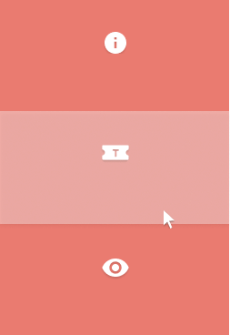

<p align ="center">МИНИСТЕРСТВО НАУКИ И ВЫСШЕГО ОБРАЗОВАНИЯ РОССИЙСКОЙ ФЕДЕРАЦИИ<br>
ФЕДЕРАЛЬНОЕ ГОСУДАРСТВЕННОЕ БЮДЖЕТНОЕ ОБРАЗОВАТЕЛЬНОЕ<br>
УЧРЕЖДЕНИЕ ВЫСШЕГО ОБРАЗОВАНИЯ<br>
«ВЯТСКИЙ ГОСУДАРСТВЕННЫЙ УНИВЕРСИТЕТ»<br>
Институт математики и информационных систем<br>
Факультет автоматики и вычислительной техники<br>
Кафедра систем автоматизации управления<br></p>
<br>
<br>
<br>
<br>
<br>
<br>
<br>
<p align= "center"><b>Стилизация элементов через CSS</b><br>
Отчет по лабораторной работе № 2<br>
по дисциплине<br>
Основы frontend-разработки и организации человеко-машинного интерфейса<br></p>
<br>
<br>
<br>
<br>
<br>
<br>
<p align="center">Выполнил студент гр. ИТб-1301-01-00 _________________ /Ласкин М.В./<br>
Руководитель ст. преподаватель _________________ /Земцов М.А./<br>
Работа защищена с оценкой			«___________» «___» __________ 2021 г.</p>
<br>
<br>
<br>
<br>
<br>
<br>

<p align="center">Киров 2021</p>
<br>
<hr>
<p>Цель работы: Стилизация и трансформация элементов через CSS. CSS процессоры.<br>
<br>
Задачи работы:<br>
<ol><li>Организовать процесс работы над лабораторной работой.</li>
<li>Изучить материал по основам стилизации элементов.</li>
<li>Выполнить верстку макета по заданию преподавателя.</li>
<li>Составить отчет по выполненным задачам.</li>
<li>Защитить лабораторную работу.</li></ol></p>
<h3>Ход работы</h3>
<br>
<h4>Задание №1</h4>
<p> Организовать процесс работы над лабораторной работой </p>
<p>В ходе организации рабочего пространства в репозитории “Basic frontend dev labs” создана ветвь “lab3”</p>
<br>
<h4>Задание №2</h4>
<p> Изучить материал по основам стилизации элементов</p>
<p> Перед выполнением работы был изучен материал по основам работы c оформлением веб-документа<br>
Ссылка: https://html5book.ru/osnovy-css/</p>
<br>
<h4>Задание №3</h4>
<p> Выполнить верстку макета по ссылке: https://www.figma.com/file/j4dslZZvb5b9JLSEYQYKMo/imdb_concept?node-id=0%3A4 . 
</p>
<p> Макет представлен на рисунке 1. </p>
<br>
<p align="center"></p>
<p align="center">Рисунок 1 – Макет</p>
<br>
<p>Выполненная верстка макета представлена на рисунке 2, результат валидации на рисунке 3.</p>
<p>Листинг файла index.html представлен в приложении А.</p>
<br>
<p align="center"></p>
<p align="center">Рисунок 2 – Реализованный макет</p>
<p align="center"></p>
<p align="center">Рисунок 3 – Успешное прохождение валидации</p>
<br>

<p> Вывод: в ходе работы была изучена документация по cтилизации и трансформации элементов через CSS. Получены навыки стилизации элементов при помощи языка CSS.</p>
<br>


<p align="center">Приложение А</p>
<p align="center">(обязательное)</p>
<p align="center">Листинг файла index.html</p>

```HTML 
<!DOCTYPE HTML>
<html lang="en">
<head>
    <title>Ласкин Максим Вячеславович</title>
    <link rel="stylesheet" href="Style.css" media="all">
</head>
<body>
    <div class="back1">  
        <div class="back2">
            <div class="head">
                
                
                
                
            </div>
            <div class="grid1">
                
                
                
                
                
                
                
                
            </div>
            <div class="grid2">
                
                <div style="background-color: #07131B;" >
                    <div class="grid7">
                        <div>
                            
                        </div>
                        <div>
                            
                            
                        </div>
                    </div>
                    <div class="grid8">
                        <div>
                            
                        </div>
                        
                        
                        
                        
                        
                    </div>
                </div>
                
                
            </div>
            <div class="grid3">
                <div class="flex1">
                    
                    
                    
                </div>
                <div>
                    <div>
                        
                        
                        
                        
                        
                    </div>
                    <div style="margin-top: 88px;">
                        
                        
                        
                        
                        
                    </div>
                </div>
                <div>
                    
                    
                    
                </div>
            </div>
            <hr>
            <div class="grid4">
                <div class="flex2">
                    
                    
                    
                    
                    
                    
                </div>
                <div>
                    
                </div>
                <div class="flex3">
                    
                    
                    
                    
                    
                    
                </div>
            </div>
            <div class="grid5">
                
                
                
                
                
                
                
                
                
                
                
                
                
                
                
            </div>
            <hr>
            <div class="grid6 items">
                <div>
                    
                    
                    
                </div>
                <div>
                    
                    
                    
                    
                    
                </div>
                <div>
                    
                    
                    
                    
                    
                    
                </div>
            </div>
            <div style="margin: 60px 0 0 40px; width: 100px; height: 20px;">
                
            </div>
        </div>
    </div>
</body>
</html>
```